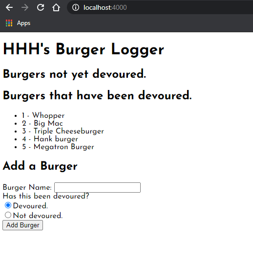

# Burger-Logger

## Description
This is my Burger Logger app, which allows users to add burgers to either a "not devoured" or "devoured" section, and then update any non-devoured burgers as having been devoured. This app uses Node, MySQL, express handlebars, and Heroku. Please feel free to view my deployed app [here](https://shielded-reef-60017.herokuapp.com/).

## Usage
When a user gets to my app, they will see a text field where they can enter a burger name, and then indicate whether or not they've devoured the burger. Depending on whether or not they've devoured the burger, the burger will be posted in either the "not devoured" or "devoured" section. If the user devours a previously non-devoured burger, they can then click the "devour the burger" button, which then switches the burger to the "devoured" section.

## Credits
I relied heavily on the work from Activities 16 and 17 in this chapter to build my app.
